<div align="center">

# CancerCare EMR


A Rails-based care-operations prototype connecting organizations, managers, doctors, and patients in one scheduling workflow.


**Rails 8** · **Hotwire (Turbo + Stimulus)** · **Devise** · **Pundit** · **Sidekiq** · **Ransack** · **PaperTrail**

</div>

> [!NOTE]
> This is a learning/portfolio project focused on organization management and appointment operations. It is **not** a production-certified clinical EMR and should not be used with real patient data.

## What the project does

CancerCare EMR provides separate, organization-aware portals for platform admins and care teams. Admins set up organizations and users; managers organize clinicians and schedules; doctors manage availability and appointments; patients find a doctor and request a time. Role-specific controllers and policies keep each workflow in its own area.

| Portal | Current capabilities |
| --- | --- |
| **Platform admin** | Manage organizations, users, doctors, and patients; access a dedicated dashboard. |
| **Organization manager** | Manage doctors and patients, recurring appointment slots, and unavailable-date exceptions. |
| **Doctor** | Manage patients, slots, exceptions, and appointments; review or change appointment status. |
| **Patient** | Browse doctors, see available slots, book or update appointments, and view or cancel bookings. |

## How booking works

```mermaid
flowchart LR
    A[Admin creates an organization] --> B[Users receive account setup email]
    B --> C[Manager and doctor publish weekly slots]
    C --> D[Exceptions block holidays or unavailable dates]
    D --> E[Patient chooses doctor and date]
    E --> F[Available slots are calculated]
    F --> G[Appointment requested as pending]
    G --> H[Doctor reviews and updates status]
    H --> I[Email notification is queued]
```



1. **Organization setup:** An admin creates an organization and its users. The organization slug is used for its subdomain; new users receive password-setup instructions.
2. **Availability:** Doctors or managers create recurring weekday slots and exceptions for holidays or blocked dates. The slot model rejects overlapping times and excludes already-booked slots from availability.
3. **Booking:** A patient selects a doctor and date. The app calculates available slots, then saves the request as **pending**. Duplicate bookings for the same slot and date are prevented unless the earlier appointment was rejected.
4. **Follow-up:** Doctors can review and update appointments to **approved** or **rejected**. Appointment creation and changes queue email notifications.

## Features in the codebase

- **Multi-organization routing:** separate admin and organization subdomains, with dashboards for each role.
- **Authentication and access control:** Devise account flows, role-based user types, and Pundit policies/scopes.
- **Scheduling:** recurring weekly slots, overlap validation, date-specific exceptions, and availability calculation.
- **Appointment lifecycle:** patient booking and updates, doctor status changes, cancellation, and duplicate-slot protection.
- **Responsive interactions:** Hotwire Turbo Streams and Stimulus alongside Tailwind CSS.
- **Operations tooling:** search/filtering with Ransack, pagination with Kaminari, change history for slots and exceptions with PaperTrail, and asynchronous email jobs through Sidekiq.
- **Organization assets:** logo upload via Active Storage.

## Technology

| Layer | Tools |
| --- | --- |
| Backend | Ruby 3.3, Rails 8, Active Record, Puma |
| Database | PostgreSQL |
| UI | Rails views, Hotwire Turbo + Stimulus, Tailwind CSS, JavaScript, esbuild |
| Identity & permissions | Devise, Pundit |
| Search & history | Ransack, Kaminari, PaperTrail |
| Jobs & email | Sidekiq, Redis, Action Mailer |
| Development & delivery | Dockerfile, Kamal configuration, RuboCop, Brakeman, Bullet |

## Run locally

**Prerequisites:** Ruby **3.3.0**, Node.js **22.19.0**, PostgreSQL, Redis, Bundler, and Yarn. The checked-in `.ruby-version` and `.node-version` files pin the language versions.

```bash
git clone https://github.com/furqan-056/cancercare-emr.git
cd cancercare-emr
bundle install
yarn install
bin/rails db:prepare
```

Start Redis and Sidekiq in separate terminals so queued emails can run:

```bash
redis-server
```

```bash
bundle exec sidekiq -C config/sidekiq.yml
```

Then start the Rails server and asset watchers:

```bash
bin/dev
```

Open **http://localhost:3000** for the landing page and **http://admin.localhost:3000** for the admin portal. Organization portals use **http://YOUR-SLUG.localhost:3000** after you create an organization. The development configuration allows `*.localhost` hosts.

**First admin:** `db/seeds.rb` does not create demo users. Create an `Admin` with your own email and a strong password in `bin/rails console` before signing in to the admin portal. In development, outgoing mail is opened locally through Letter Opener.

## Tests and checks

```bash
bin/rails test
bin/rails test:system
bundle exec rubocop
bundle exec brakeman
```

The repository includes Rails test infrastructure and development/security tooling; the commands above are ways to run the available checks, not a claim of complete test coverage.

## Project status

This repository demonstrates a care-operations workflow rather than a complete medical-record system. Clinical charting, diagnoses, prescriptions, and compliance controls are outside the current implementation. Screenshots and a hosted demo can be added later without changing the documented workflow.

---

<div align="center">Built as a hands-on Rails project by <a href="https://github.com/furqan-056">Muhammad Furqan</a>.</div>
